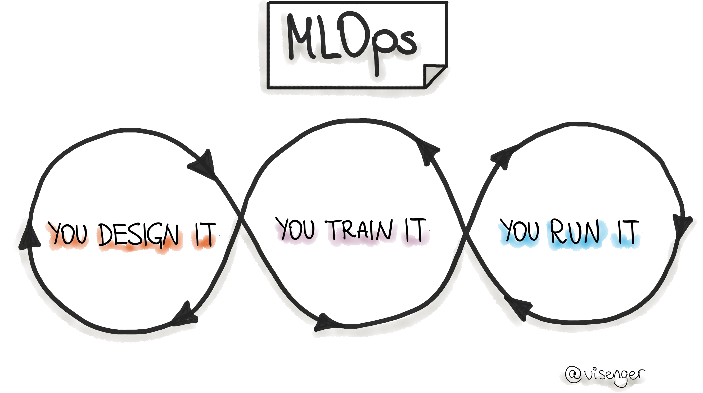

# Awesome MLOps   

*An awesome list of references for MLOps - Machine Learning Operations :point_right: [ml-ops.org](https://ml-ops.org/)*

# Table of Content
| <!-- -->                         | <!-- -->                         |
| -------------------------------- | -------------------------------- |
| [MLOps Core](#core-mlops) | [MLOps Communities](#mlops-communities) |
| [MLOps Books](#mlops-books) | [MLOps Articles](#mlops-articles) |
| [MLOps: Feature Stores](#feature-stores) | [MLOps: Data Engineering (DataOps)](#dataops) |
| [MLOps: Model Deployment and Serving](#deployment) |[MLOps: Testing, Monitoring and Maintenance](#testing-monintoring)
| [MLOps: Infrastructure](#mlops-infra)| [MLOps Papers](#mlops-papers) | 
| [Talks About MLOps](#talks-about-mlops) | [Existing ML Systems](#existing-ml-systems) | 
| [Machine Learning](#machine-learning) | [Software Engineering](#software-engineering) | 
| [Product Management for ML/AI](#product-management-for-mlai) | [The Economics of ML/AI](#the-economics-of-mlai) | 
| [Model Governance, Ethics, Responsible AI](#ml-governance) | [Newsletters About MLOps, Machine Learning, Data Science and Co.](#newsletters)|

# MLOps Core

1. [Machine Learning Operations: You Design It, You Train It, You Run It!](https://ml-ops.org/)
1. [MLOps SIG Specification](https://github.com/tdcox/mlops-roadmap/blob/master/MLOpsRoadmap2020.md)
1. [ML in Production](http://mlinproduction.com/)
1. [Awesome production machine learning: State of MLOps Tools and Frameworks](https://github.com/EthicalML/awesome-production-machine-learning)
1. [Udemy “Deployment of ML Models”](https://www.udemy.com/course/deployment-of-machine-learning-models/)
1. [Full Stack Deep Learning](https://course.fullstackdeeplearning.com/)
1. [Engineering best practices for Machine Learning](https://se-ml.github.io/practices/)
1. [:rocket: Putting ML in Production](https://madewithml.com/courses/putting-ml-in-production/)
1. [Stanford MLSys Seminar Series](https://mlsys.stanford.edu/)
1. [IBM ML Operationalization Starter Kit](https://github.com/ibm-cloud-architecture/refarch-ml-ops)
1. [Productize ML. A self-study guide for Developers and Product Managers building Machine Learning products.](https://productizeml.gitbook.io/productize-ml/)
1. [MLOps (Machine Learning Operations) Fundamentals on GCP](https://www.coursera.org/learn/mlops-fundamentals)
2. [ML full Stack preparation](https://www.confetti.ai/)

# MLOps Communities

1. [MLOps.community](https://mlops.community/)
1. [CDF Special Interest Group - MLOps](https://github.com/cdfoundation/sig-mlops)
1. [RsqrdAI - Robust and Responsible AI](https://www.rsqrdai.org)
1. [DataTalks.Club](https://datatalks.club/)

# MLOps Books

1. [“Machine Learning Engineering” by Andriy Burkov, 2020](http://www.mlebook.com/wiki/doku.php?id=start)
1. ["ML Ops: Operationalizing Data Science" by David Sweenor, Steven Hillion, Dan Rope, Dev Kannabiran, Thomas Hill, Michael O'Connell](https://learning.oreilly.com/library/view/ml-ops-operationalizing/9781492074663/)
1. ["Building Machine Learning Powered Applications" by Emmanuel Ameisen](https://learning.oreilly.com/library/view/building-machine-learning/9781492045106/)
1. ["Building Machine Learning Pipelines" by Hannes Hapke, Catherine Nelson, 2020, O’Reilly](https://learning.oreilly.com/library/view/building-machine-learning/9781492053187/) 
1. ["Managing Data Science" by Kirill Dubovikov](https://www.packtpub.com/eu/data/managing-data-science)
1. ["Accelerated DevOps with AI, ML & RPA: Non-Programmer's Guide to AIOPS & MLOPS" by Stephen Fleming](https://www.amazon.com/Accelerated-DevOps-AI-RPA-Non-Programmers-ebook/dp/B07ZMJCJRS)
1. ["Evaluating Machine Learning Models" by Alice Zheng](https://learning.oreilly.com/library/view/evaluating-machine-learning/9781492048756/)
1. [Agile AI. 2020. By Carlo Appugliese, Paco Nathan, William S. Roberts. O'Reilly Media, Inc.](https://learning.oreilly.com/library/view/agile-ai/9781492074984/)
1. ["Machine Learning Logistics". 2017. By T. Dunning et al. O'Reilly Media Inc.](https://mapr.com/ebook/machine-learning-logistics/)
1. ["Machine Learning Design Patterns" by Valliappa Lakshmanan, Sara Robinson, Michael Munn. O'Reilly 2020](https://learning.oreilly.com/library/view/machine-learning-design/9781098115777/)
1. ["Serving Machine Learning Models: A Guide to Architecture, Stream Processing Engines, and Frameworks" by Boris Lublinsky, O'Reilly Media, Inc. 2017](https://www.lightbend.com/ebooks/machine-learning-guide-architecture-stream-processing-frameworks-oreilly)
1. ["Kubeflow for Machine Learning" by Holden Karau, Trevor Grant, Ilan Filonenko, Richard Liu, Boris Lublinsky](https://learning.oreilly.com/library/view/kubeflow-for-machine/9781492050117/)
1. ["Clean Machine Learning Code" by Moussa Taifi. Leanpub. 2020](https://leanpub.com/cleanmachinelearningcode)
1. [E-Book "Practical MLOps. How to Get Ready for Production Models"](https://valohai.com/mlops-ebook/)
1. ["Introducing MLOps" by Mark Treveil, et al. O'Reilly Media, Inc. 2020](https://learning.oreilly.com/library/view/introducing-mlops/9781492083283/)
1. ["Machine Learning for Data Streams with Practical Examples in MOA", Bifet, Albert and Gavald\`a, Ricard and Holmes, Geoff and Pfahringer, Bernhard, MIT Press, 2018](https://moa.cms.waikato.ac.nz/book/)
1. ["Machine Learning Product Manual" by Laszlo Sragner, Chris Kelly](https://machinelearningproductmanual.com/)

# MLOps Articles

1. [Continuous Delivery for Machine Learning (by Thoughtworks)](https://martinfowler.com/articles/cd4ml.html)
1. [What is MLOps? NVIDIA Blog](https://blogs.nvidia.com/blog/2020/09/03/what-is-mlops/)
1. [MLSpec: A project to standardize the intercomponent schemas for a multi-stage ML Pipeline.](https://github.com/visenger/MLSpec)
1. [The 2021 State of Enterprise Machine Learning](https://info.algorithmia.com/tt-state-of-ml-2021) | State of Enterprise ML 2020: [PDF](https://info.algorithmia.com/hubfs/2019/Whitepapers/The-State-of-Enterprise-ML-2020/Algorithmia_2020_State_of_Enterprise_ML.pdf) and [Interactive](https://algorithmia.com/state-of-ml)
1. [Organizing machine learning projects: project management guidelines.](https://www.jeremyjordan.me/ml-projects-guide/)
1. [Rules for ML Project (Best practices)](http://martin.zinkevich.org/rules_of_ml/rules_of_ml.pdf)
1. [ML Pipeline Template](https://www.agilestacks.com/tutorials/ml-pipelines)
1. [Data Science Project Structure](https://drivendata.github.io/cookiecutter-data-science/#directory-structure)
1. [Reproducible ML](https://github.com/cmawer/reproducible-model)
1. [ML project template facilitating both research and production phases.](https://github.com/visenger/ml-project-template)
1. [Machine learning requires a fundamentally different deployment approach. As organizations embrace machine learning, the need for new deployment tools and strategies grows.](https://www.oreilly.com/radar/machine-learning-requires-a-fundamentally-different-deployment-approach/)
1. [Why is DevOps for Machine Learning so Different?](https://hackernoon.com/why-is-devops-for-machine-learning-so-different-384z32f1)
1. [Lessons learned turning machine learning models into real products and services – O’Reilly](https://www.oreilly.com/radar/lessons-learned-turning-machine-learning-models-into-real-products-and-services/)
1. [MLOps: Model management, deployment and monitoring with Azure Machine Learning](https://docs.microsoft.com/en-gb/azure/machine-learning/concept-model-management-and-deployment)
1. [Guide to File Formats for Machine Learning: Columnar, Training, Inferencing, and the Feature Store](https://towardsdatascience.com/guide-to-file-formats-for-machine-learning-columnar-training-inferencing-and-the-feature-store-2e0c3d18d4f9)
1. [Architecting a Machine Learning Pipeline How to build scalable Machine Learning systems](https://towardsdatascience.com/architecting-a-machine-learning-pipeline-a847f094d1c7)
1. [Why Machine Learning Models Degrade In Production](https://towardsdatascience.com/why-machine-learning-models-degrade-in-production-d0f2108e9214)
1. [Concept Drift and Model Decay in Machine Learning](http://xplordat.com/2019/04/25/concept-drift-and-model-decay-in-machine-learning/?source=post_page---------------------------)
1. [Bringing ML to Production](https://www.slideshare.net/mikiobraun/bringing-ml-to-production-what-is-missing-amld-2020)
1. [A Tour of End-to-End Machine Learning Platforms](https://databaseline.tech/a-tour-of-end-to-end-ml-platforms/)
1. [MLOps: Continuous delivery and automation pipelines in machine learning](https://cloud.google.com/solutions/machine-learning/mlops-continuous-delivery-and-automation-pipelines-in-machine-learning)
1. [AI meets operations](https://www.oreilly.com/radar/ai-meets-operations/)
1. [What would machine learning look like if you mixed in DevOps? Wonder no more, we lift the lid on MLOps](https://www.theregister.co.uk/2020/03/07/devops_machine_learning_mlops/)
1. [Forbes: The Emergence Of ML Ops](https://www.forbes.com/sites/cognitiveworld/2020/03/08/the-emergence-of-ml-ops/#72f04ed04698)
1. [Cognilytica Report "ML Model Management and Operations 2020 (MLOps)"](https://www.cognilytica.com/2020/03/03/ml-model-management-and-operations-2020-mlops/) 
1. [Introducing Cloud AI Platform Pipelines](https://cloud.google.com/blog/products/ai-machine-learning/introducing-cloud-ai-platform-pipelines)
1. [A Guide to Production Level Deep Learning ](https://github.com/alirezadir/Production-Level-Deep-Learning/blob/master/README.md)
1. [The 5 Components Towards Building Production-Ready Machine Learning Systems](https://medium.com/cracking-the-data-science-interview/the-5-components-towards-building-production-ready-machine-learning-system-a4d5237ec04e)
1. [Deep Learning in Production (references about deploying deep learning-based models in production)](https://github.com/ahkarami/Deep-Learning-in-Production)
1. [Machine Learning Experiment Tracking](https://towardsdatascience.com/machine-learning-experiment-tracking-93b796e501b0)
1. [The Team Data Science Process (TDSP)](https://docs.microsoft.com/en-us/azure/machine-learning/team-data-science-process/overview)
1. [MLOps Solutions (Azure based)](https://github.com/visenger/MLOps)
1. [Monitoring ML pipelines](https://intothedepthsofdataengineering.wordpress.com/2020/02/13/monitoring-ml-pipelines/)
1. [Deployment & Explainability of Machine Learning COVID-19 Solutions at Scale with Seldon Core and Alibi](https://github.com/axsaucedo/seldon-core/tree/corona_research_exploration/examples/models/research_paper_classification)
1. [Demystifying AI Infrastructure](https://www.intel.com/content/www/us/en/intel-capital/news/story.html?id=a0F1I00000BNTXPUA5#/type=All/page=0/term=/tags=)
1. [Organizing machine learning projects: project management guidelines.](https://www.jeremyjordan.me/ml-projects-guide/)
1. [The Checklist for Machine Learning Projects (from Aurélien Géron,"Hands-On Machine Learning with Scikit-Learn and TensorFlow")](https://github.com/visenger/handson-ml/blob/master/ml-project-checklist.md)
1. [Data Project Checklist by Jeremy Howard](https://www.fast.ai/2020/01/07/data-questionnaire/)
1. [MLOps: not as Boring as it Sounds](https://itnext.io/mlops-not-as-boring-as-it-sounds-eaebe73e3533)
1. [10 Steps to Making Machine Learning Operational. Cloudera White Paper](https://www.cloudera.com/content/dam/www/marketing/resources/whitepapers/10-steps-to-making-ml-operational.pdf)
1. [MLOps is Not Enough. The Need for an End-to-End Data Science Lifecycle Process.](https://techcommunity.microsoft.com/t5/azure-ai/mlops-is-not-enough/ba-p/1386789)
1. [Data Science Lifecycle Repository Template](https://github.com/dslp/dslp-repo-template)
1. [Template: code and pipeline definition for a machine learning project demonstrating how to automate an end to end ML/AI workflow. ](https://github.com/aronchick/MLOps-pipeline)
1. [Nitpicking Machine Learning Technical Debt](https://matthewmcateer.me/blog/machine-learning-technical-debt/)
1. [The Best Tools, Libraries, Frameworks and Methodologies that Machine Learning Teams Actually Use – Things We Learned from 41 ML Startups](https://neptune.ai/blog/tools-libraries-frameworks-methodologies-ml-startups-roundup)
1. [Software Engineering for AI/ML - An Annotated Bibliography](https://github.com/ckaestne/seaibib)
1. [Intelligent System. Machine Learning in Practice](https://intelligentsystem.io/)
1. [CMU 17-445/645: Software Engineering for AI-Enabled Systems (SE4AI)](https://github.com/ckaestne/seai/)
1. [Machine Learning is Requirements Engineering](https://link.medium.com/l7akzjR826)
1. [Machine Learning Reproducibility Checklist](https://www.cs.mcgill.ca/~jpineau/ReproducibilityChecklist.pdf)
1. [Machine Learning Ops. A collection of resources on how to facilitate Machine Learning Ops with GitHub.](http://mlops-github.com/)
1. [Task Cheatsheet for Almost Every Machine Learning Project A checklist of tasks for building End-to-End ML projects](https://towardsdatascience.com/task-cheatsheet-for-almost-every-machine-learning-project-d0946861c6d0)
1. [Web services vs. streaming for real-time machine learning endpoints](https://towardsdatascience.com/web-services-vs-streaming-for-real-time-machine-learning-endpoints-c08054e2b18e)
1. [How PyTorch Lightning became the first ML framework to run continuous integration on TPUs](https://medium.com/pytorch/how-pytorch-lightning-became-the-first-ml-framework-to-runs-continuous-integration-on-tpus-a47a882b2c95)
1. [The ultimate guide to building maintainable Machine Learning pipelines using DVC](https://towardsdatascience.com/the-ultimate-guide-to-building-maintainable-machine-learning-pipelines-using-dvc-a976907b2a1b)
1. [Continuous Machine Learning (CML) is CI/CD for Machine Learning Projects (DVC)](https://cml.dev/)
1. [What I learned from looking at 200 machine learning tools](https://huyenchip.com/2020/06/22/mlops.html)
1. [Big Data & AI Landscape](http://mattturck.com/wp-content/uploads/2018/07/Matt_Turck_FirstMark_Big_Data_Landscape_2018_Final.png)
1. [Deploying Machine Learning Models as Data, not Code — A better match?](https://towardsdatascience.com/deploying-machine-learning-models-as-data-not-code-omega-ml-8825a0ae530a)
1. [“Thou shalt always scale” — 10 commandments of MLOps](https://towardsdatascience.com/mlops-thou-shalt-always-scale-10-commandments-of-mlops-152c11e711a5)
1. [Three Risks in Building Machine Learning Systems](https://insights.sei.cmu.edu/sei_blog/2020/05/three-risks-in-building-machine-learning-systems.html)
1. [Blog about ML in production (by maiot.io)](https://blog.maiot.io/)
1. Back to the Machine Learning fundamentals: How to write code for Model deployment. [Part 1](https://medium.com/@ivannardini/back-to-the-machine-learning-fundamentals-how-to-write-code-for-model-deployment-part-1-3-4b05deda1cd1), [Part 2](https://medium.com/@ivannardini/back-to-the-machine-learning-fundamentals-how-to-write-code-for-model-deployment-part-2-3-9632d5a43f98), [Part 3](https://medium.com/@ivannardini/back-to-the-machine-learning-fundamentals-how-to-write-code-for-model-deployment-part-3-3-fb85102bebb2)
1. [MLOps: Machine Learning as an Engineering Discipline](https://towardsdatascience.com/ml-ops-machine-learning-as-an-engineering-discipline-b86ca4874a3f)
1. [ML Engineering on Google Cloud Platform (hands-on labs and code samples)](https://github.com/GoogleCloudPlatform/mlops-on-gcp)
1. [Deep Reinforcement Learning in Production. The use of Reinforcement Learning to Personalize User Experience at Zynga](https://towardsdatascience.com/deep-reinforcement-learning-in-production-7e1e63471e2)
1. [What is Data Observability?](https://towardsdatascience.com/what-is-data-observability-40b337971e3e)
1. [A Practical Guide to Maintaining Machine Learning in Production](https://eugeneyan.com/writing/practical-guide-to-maintaining-machine-learning/)
1. Continuous Machine Learning. [Part 1](https://mribeirodantas.xyz/blog/index.php/2020/08/10/continuous-machine-learning/), [Part 2](https://mribeirodantas.xyz/blog/index.php/2020/08/18/continuous-machine-learning-part-ii/). Part 3 is coming soon.
1. [The Agile approach in data science explained by an ML expert](https://www.iunera.com/kraken/big-data-science-strategy/the-agile-approach-in-data-science-explained-by-an-ml-expert/)
1. [Here is what you need to look for in a model server to build ML-powered services](https://anyscale.com/blog/heres-what-you-need-to-look-for-in-a-model-server-to-build-ml-powered-services/)
1. [The problem with AI developer tools for enterprises (and what IKEA has to do with it)](https://towardsdatascience.com/the-problem-with-ai-developer-tools-for-enterprises-and-what-ikea-has-to-do-with-it-b26277841661)
1. [Streaming Machine Learning with Tiered Storage](https://www.confluent.io/blog/streaming-machine-learning-with-tiered-storage/)
1. [Best practices for performance and cost optimization for machine learning (Google Cloud)](https://cloud.google.com/solutions/machine-learning/best-practices-for-ml-performance-cost)
1. [Lean Data and Machine Learning Operations](https://databaseline.tech/lean-dml-operations/)
1. [A Brief Guide to Running ML Systems in Production Best Practices for Site Reliability Engineers](https://www.oreilly.com/content/a-brief-guide-to-running-ml-systems-in-production/)
1. [AI engineering practices in the wild - SIG | Getting software right for a healthier digital world](https://www.softwareimprovementgroup.com/resources/ai-engineering-practices-in-the-wild/)
1. [SE-ML | The 2020 State of Engineering Practices for Machine Learning](https://se-ml.github.io/report2020)
1. [Awesome Software Engineering for Machine Learning (GitHub repository)](https://github.com/SE-ML/awesome-seml)
1. [Sampling isn’t enough, profile your ML data instead](https://towardsdatascience.com/sampling-isnt-enough-profile-your-ml-data-instead-6a28fcfb2bd4?source=friends_link&sk=5af46143562d348b182c449265ed54fb)
1. [Reproducibility in ML: why it matters and how to achieve it](https://determined.ai/blog/reproducibility-in-ml/)
1. [12 Factors of reproducible Machine Learning in production](https://blog.maiot.io/12-factors-of-ml-in-production/)
1. [MLOps: More Than Automation](https://devops.com/mlop-more-than-automation/)
1. [Lean Data Science](https://locallyoptimistic.com/post/lean-data-science/)
1. [Engineering Skills for Data Scientists](https://mark.douthwaite.io/tag/engineering-skills-for-data-scientists/)
1. [DAGsHub Blog. Read about data science and machine learning workflows, MLOps, and open source data science](https://dagshub.com/blog/)
1. [Data Science Project Flow for Startups](https://towardsdatascience.com/data-science-project-flow-for-startups-282a93d4508d)
1. [Data Science Engineering at Shopify](https://shopify.engineering/topics/data-science-engineering)
1. [Building state-of-the-art machine learning technology with efficient execution for the crypto economy](https://blog.coinbase.com/building-state-of-the-art-machine-learning-technology-with-efficient-execution-for-the-crypto-ad10896a48a)
1. [Completing the Machine Learning Loop](https://jimmymwhitaker.medium.com/completing-the-machine-learning-loop-e03c784eaab4)
1. [Deploying Machine Learning Models: A Checklist](https://twolodzko.github.io/ml-checklist) 

# MLOps: Feature Stores

1. [Feature Stores for Machine Learning Medium Blog](https://medium.com/data-for-ai)
1. [MLOps with a Feature Store](https://www.logicalclocks.com/blog/mlops-with-a-feature-store)
1. [Feature Stores for ML](http://featurestore.org/)
1. [Hopsworks: Data-Intensive AI with a Feature Store](https://github.com/logicalclocks/hopsworks)
1. [Feast: An open-source Feature Store for Machine Learning](https://github.com/feast-dev/feast)
1. [What is a Feature Store?](https://www.tecton.ai/blog/what-is-a-feature-store/)
1. [ML Feature Stores: A Casual Tour](https://medium.com/@farmi/ml-feature-stores-a-casual-tour-fc45a25b446a)
1. [Comprehensive List of Feature Store Architectures for Data Scientists and Big Data Professionals](https://hackernoon.com/the-essential-architectures-for-every-data-scientist-and-big-data-engineer-f21u3e5c)
1. [ML Engineer Guide: Feature Store vs Data Warehouse (vendor blog)](https://www.logicalclocks.com/blog/feature-store-vs-data-warehouse)
1. [Building a Gigascale ML Feature Store with Redis, Binary Serialization, String Hashing, and Compression (DoorDash blog)](https://doordash.engineering/2020/11/19/building-a-gigascale-ml-feature-store-with-redis/)
1. [Feature Stores: Variety of benefits for Enterprise AI.](https://insidebigdata.com/2020/12/29/how-feature-stores-will-revolutionize-enterprise-ai/)

# MLOps: Data Engineering (DataOps)

1. [The state of data quality in 2020 – O’Reilly](https://www.oreilly.com/radar/the-state-of-data-quality-in-2020/)
1. [Why We Need DevOps for ML Data](https://tecton.ai/blog/devops-ml-data/) 
1. [Data Preparation for Machine Learning (7-Day Mini-Course)](https://machinelearningmastery.com/data-preparation-for-machine-learning-7-day-mini-course/)
1. [Best practices in data cleaning: A Complete Guide to Everything You Need to Do Before and After Collecting Your Data.](https://www.researchgate.net/publication/266714997_Best_practices_in_data_cleaning_A_Complete_Guide_to_Everything_You_Need_to_Do_Before_and_After_Collecting_Your_Data)
1. [17 Strategies for Dealing with Data, Big Data, and Even Bigger Data](https://towardsdatascience.com/17-strategies-for-dealing-with-data-big-data-and-even-bigger-data-283426c7d260)
1. [DataOps Data Architecture](https://blog.datakitchen.io/blog/dataops-data-architecture)
1. [Data Orchestration — A Primer](https://medium.com/memory-leak/data-orchestration-a-primer-56f3ddbb1700)
1. [4 Data Trends to Watch in 2020](https://medium.com/memory-leak/4-data-trends-to-watch-in-2020-491707902c09)
1. [CSE 291D / 234: Data Systems for Machine Learning](http://cseweb.ucsd.edu/classes/fa20/cse291-d/index.html)
1. [A complete picture of the modern data engineering landscape](https://github.com/datastacktv/data-engineer-roadmap)
1. [Continuous Integration for your data with GitHub Actions and Great Expectations. One step closer to CI/CD for your data pipelines](https://greatexpectations.io/blog/github-actions/)
1. [Emerging Architectures for Modern Data Infrastructure](https://a16z.com/2020/10/15/the-emerging-architectures-for-modern-data-infrastructure/)
1. [Awesome Data Engineering. Learning path and resources to become a data engineer](https://awesomedataengineering.com/)
1. Data Quality at Airbnb [Part 1](https://medium.com/airbnb-engineering/data-quality-at-airbnb-e582465f3ef7) | [Part 2](https://medium.com/airbnb-engineering/data-quality-at-airbnb-870d03080469)
1. [DataHub: Popular metadata architectures explained](https://engineering.linkedin.com/blog/2020/datahub-popular-metadata-architectures-explained)
1. [Financial Times Data Platform: From zero to hero. An in-depth walkthrough of the evolution of our Data Platform](https://medium.com/ft-product-technology/financial-times-data-platform-from-zero-to-hero-143156bffb1d)

 
# MLOps: Model Deployment and Serving

1. [AI Infrastructure for Everyone: DeterminedAI](https://determined.ai/)
1. [Deploying R Models with MLflow and Docker](https://mdneuzerling.com/post/deploying-r-models-with-mlflow-and-docker/)
1. [What Does it Mean to Deploy a Machine Learning Model?](https://mlinproduction.com/what-does-it-mean-to-deploy-a-machine-learning-model-deployment-series-01/)
1. [Software Interfaces for Machine Learning Deployment](https://mlinproduction.com/software-interfaces-for-machine-learning-deployment-deployment-series-02/)
1. [Batch Inference for Machine Learning Deployment](https://mlinproduction.com/batch-inference-for-machine-learning-deployment-deployment-series-03/)
1. [AWS Cost Optimization for ML Infrastructure - EC2 spend](https://blog.floydhub.com/aws-cost-optimization-for-ml-infra-ec2/)
1. [CI/CD for Machine Learning & AI](https://blog.paperspace.com/ci-cd-for-machine-learning-ai/)
1. [Itaú Unibanco: How we built a CI/CD Pipeline for machine learning with ***online training*** in Kubeflow](https://cloud.google.com/blog/products/ai-machine-learning/itau-unibanco-how-we-built-a-cicd-pipeline-for-machine-learning-with-online-training-in-kubeflow)
1. [101 For Serving ML Models](https://pakodas.substack.com/p/101-for-serving-ml-models-10217c9f0764)
1. [Deploying Machine Learning models to production — **Inference service architecture patterns**](https://medium.com/data-for-ai/deploying-machine-learning-models-to-production-inference-service-architecture-patterns-bc8051f70080)
1. [Serverless ML: Deploying Lightweight Models at Scale](https://mark.douthwaite.io/serverless-machine-learning/)
1. ML Model Rollout To Production. [Part 1](https://www.superwise.ai/resources/safely-rolling-out-ml-models-to-production) | [Part 2](https://www.superwise.ai/resources/part-ii-safely-rolling-out-models-to-production)
1. [Deploying Python ML Models with Flask, Docker and Kubernetes](https://alexioannides.com/2019/01/10/deploying-python-ml-models-with-flask-docker-and-kubernetes/)
1. [Deploying Python ML Models with Bodywork](https://alexioannides.com/2020/12/01/deploying-python-ml-models-with-bodywork/)

 
 
# MLOps: Testing, Monitoring and Maintenance

1. [Building dashboards for operational visibility (AWS)](https://aws.amazon.com/builders-library/building-dashboards-for-operational-visibility/)
1. [Monitoring Machine Learning Models in Production](https://christophergs.com/machine%20learning/2020/03/14/how-to-monitor-machine-learning-models/)
1. [Effective testing for machine learning systems](https://www.jeremyjordan.me/testing-ml/)
1. [Unit Testing Data: What is it and how do you do it?](https://winderresearch.com/unit-testing-data-what-is-it-and-how-do-you-do-it/)
1. [How to Test Machine Learning Code and Systems](https://eugeneyan.com/writing/testing-ml/) ([Accompanying code](https://github.com/eugeneyan/testing-ml))
1. [Wu, T., Dong, Y., Dong, Z., Singa, A., Chen, X. and Zhang, Y., 2020. Testing Artificial Intelligence System Towards Safety and Robustness: State of the Art. IAENG International Journal of Computer Science, 47(3).](http://www.iaeng.org/IJCS/issues_v47/issue_3/IJCS_47_3_13.pdf)
1. [Multi-Armed Bandits and the Stitch Fix Experimentation Platform](https://multithreaded.stitchfix.com/blog/2020/08/05/bandits/)
1. [A/B Testing Machine Learning Models](https://mlinproduction.com/ab-test-ml-models-deployment-series-08/)
1. [Data validation for machine learning. Polyzotis, N., Zinkevich, M., Roy, S., Breck, E. and Whang, S., 2019. Proceedings of Machine Learning and Systems](https://mlsys.org/Conferences/2019/doc/2019/167.pdf)
1. [Testing machine learning based systems: a systematic mapping](https://link.springer.com/content/pdf/10.1007/s10664-020-09881-0.pdf)
1. [Explainable Monitoring: Stop flying blind and monitor your AI](https://blog.fiddler.ai/2020/04/explainable-monitoring-stop-flying-blind-and-monitor-your-ai/)
1. [WhyLogs: Embrace Data Logging Across Your ML Systems](https://medium.com/whylabs/whylogs-embrace-data-logging-a9449cd121d)
1. [Evidently AI. Insights on doing machine learning in production. (Vendor blog.)](https://evidentlyai.com/blog)
1. [The definitive guide to comprehensively monitoring your AI](https://www.monalabs.io/mona-blog/definitiveguidetomonitorai)
1. [Introduction to Unit Testing for Machine Learning](https://themlrebellion.com/blog/Introduction-To-Unit-Testing-Machine-Learning/)
1. [Production Machine Learning Monitoring: Outliers, Drift, Explainers & Statistical Performance](https://towardsdatascience.com/production-machine-learning-monitoring-outliers-drift-explainers-statistical-performance-d9b1d02ac158)
1. Test-Driven Development in MLOps [Part 1](https://medium.com/mlops-community/test-driven-development-in-mlops-part-1-8894575f4dec)

# MLOps: Infrastructure

1. [MLOps Infrastructure Stack Canvas](https://miro.com/app/board/o9J_lfoc4Hg=/)
1. [Rise of the Canonical Stack in Machine Learning. How a Dominant New Software Stack Will Unlock the Next Generation of Cutting Edge AI Apps](https://towardsdatascience.com/rise-of-the-canonical-stack-in-machine-learning-724e7d2faa75)
1. [AI Infrastructure Alliance. Building the canonical stack for AI/ML](https://ai-infrastructure.org/)
1. [Linux Foundation AI Foundation](https://wiki.lfai.foundation/)
1. ML Infrastructure Tools for Production | [Part 1 — Production ML — The Final Stage of the Model Workflow](https://towardsdatascience.com/ml-infrastructure-tools-for-production-1b1871eecafb) | [Part 2 — Model Deployment and Serving](https://towardsdatascience.com/ml-infrastructure-tools-for-production-part-2-model-deployment-and-serving-fcfc75c4a362)
1. [The MLOps Stack Template (by valohai)](https://valohai.com/blog/the-mlops-stack/)

# MLOps Papers

1. [Studer, S., Bui, T.B., Drescher, C., Hanuschkin, A., Winkler, L., Peters, S. and Mueller, K.R., 2020. "Towards CRISP-ML (Q): A Machine Learning Process Model with Quality Assurance Methodology". arXiv](https://arxiv.org/pdf/2003.05155.pdf)
1. [Building a Reproducible Machine Learning Pipeline](https://arxiv.org/ftp/arxiv/papers/1810/1810.04570.pdf)
1. [A Systems Perspective to Reproducibility in Production Machine Learning Domain](https://openreview.net/pdf?id=Byl4vavigX)
1. [Hidden Technical Debt in Machine Learning Systems](https://papers.nips.cc/paper/5656-hidden-technical-debt-in-machine-learning-systems.pdf)
1. [Scaling Machine Learning as a Service (Uber)](http://proceedings.mlr.press/v67/li17a/li17a.pdf)
1. [What’s your ML Test Score? A rubric for ML production systems](https://storage.googleapis.com/pub-tools-public-publication-data/pdf/45742.pdf)
1. [Adversarial Machine Learning Reading List](https://nicholas.carlini.com/writing/2018/adversarial-machine-learning-reading-list.html)
1. [From What to How: An Initial Review of Publicly Available AI Ethics Tools, Methods and Research to Translate Principles into Practices](https://arxiv.org/pdf/1905.06876.pdf)
1. [Workshop on MLOps Systems. 2020 Third Conference on Machine Learning and Systems (MLSys)](https://mlops-systems.github.io/)
1. [sensAI: Fast ConvNets Serving on Live Data via Class Parallelism. Guanhua Wang, Zhuang Liu, Siyuan Zhuang, Brandon Hsieh, Joseph Gonzalez and Ion Stoica.](https://rise.cs.berkeley.edu/wp-content/uploads/2020/01/sensAI_2_pager.pdf)
1. [Towards Automated ML Model Monitoring: Measure, Improve and Quantify Data Quality. Tammo Rukat, Dustin Lange, Sebastian Schelter and Felix Biessmann.](https://ssc.io/pdf/autoops.pdf)
1. [Towards Automating the AI Operations Lifecycle. Matthew Arnold, Jeff Boston, Michael Desmond, Evelyn Duesterwald, Benjamin Elder, Anupama Murthi, Jiri Navratil and Darrell Reimer.](https://arxiv.org/pdf/2003.12808)
1. *Efficient Scheduling of DNN Training on Multitenant Clusters.* Deepak Narayanan, Keshav Santhanam, Amar Phanishayee and Matei Zaharia.
1. [Towards Complaint-driven ML Workflow Debugging. Weiyuan Wu, Lampros Flokas, Eugene Wu and Jiannan Wang.](http://wooya.me/files/MLSys_2020.pdf)
1. [PerfGuard: Deploying ML-for-Systems without Performance Regressions. H M Sajjad Hossain, Lucas Rosenblatt, Gilbert Antonius, Irene Shaffer, Remmelt Ammerlaan, Abhishek Roy, Markus Weimer, Hiren Patel, Marc Friedman, Shi Qiao, Peter Orenberg, Soundarajan Srinivasan and Alekh Jindal.](http://jindal-web.appspot.com/papers/perfguard.pdf)
1. [*Implicit Provenance for Machine Learning Artifacts.* Alexandru A. Ormenisan, Mahmoud Ismail, Seif Haridi and Jim Dowling.](https://dcatkth.github.io/papers/provenance_mlsys20.pdf)
1. [Addressing the Memory Bottleneck in AI Model-Training. David Ojika, Bhavesh Patel, G Anthony Reina, Trent Boyer, Chad Martin and Prashant Shah.](https://arxiv.org/pdf/2003.08732)
1. [Simulating Performance of ML Systems with Offline Profiling. Hongming Huang, Peng Cheng, Hong Xu and Yongqiang Xiong.](https://arxiv.org/pdf/2002.06790.pdf)
1. [A Viz Recommendation System: ML Lifecycle at Tableau. Kazem Jahanbakhsh, Eric Borchu, Mya Warren, Xiang-Bo Mao and Yogesh Sood.](https://haikufactory.com/wp-content/uploads/2020/03/MLOps2020_Cerebro.pdf)
1. [CodeReef: an open platform for portable MLOps, reusable automation actions and reproducible benchmarking. Grigori Fursin, Herve Guillou and Nicolas Essayan.](https://arxiv.org/pdf/2001.07935v1.pdf)
1. *Towards split learning at scale: System design.* Iker Rodríguez, Eduardo Muñagorri, Alberto Roman, Abhishek Singh, Praneeth Vepakomma and Ramesh Raskar.
1. *MLBox: Towards Reproducible ML.* Victor Bittorf, Xinyuan Huang, Peter Mattson, Debojyoti Dutta, David Aronchick, Emad Barsoum, Sarah Bird, Sergey Serebryakov, Natalia Vassilieva, Tom St. John, Grigori Fursin, Srini Bala, Sivanagaraju Yarramaneni, Alka Roy, David Kanter and Elvira Dzhuraeva.
1. *Conversational Applications and Natural Language Understanding Services at Scale.* Minh Tue Vo Thanh and Vijay Ramakrishnan.
1. [Towards Distribution Transparency for Supervised ML With Oblivious Training Functions. Moritz Meister, Sina Sheikholeslami, Robin Andersson, Alexandru Ormenisan and Jim Dowling.](https://content.logicalclocks.com/hubfs/research/oblivious-training_mlsys20.pdf)
1. *Tools for machine learning experiment management.* Vlad Velici and Adam Prügel-Bennett.
1. *MLPM: Machine Learning Package Manager.* Xiaozhe Yao.
1. [Common Problems with Creating Machine Learning Pipelines from Existing Code. Katie O’Leary, Makoto Uchida.](https://storage.googleapis.com/pub-tools-public-publication-data/pdf/b50bc83882bbd29c50250d1e59fbc3afda3fb5e5.pdf)
28. [Overton: A Data System for Monitoring and Improving Machine-Learned Products, Apple.](https://arxiv.org/pdf/1909.05372.pdf)
1. [Reliance on Metrics is a Fundamental Challenge for AI](https://arxiv.org/pdf/2002.08512.pdf)
1. ["Assuring the machine learning lifecycle: Desiderata, methods, and challenges." Ashmore, Rob, Radu Calinescu, and Colin Paterson. (2019)](https://arxiv.org/pdf/1905.04223.pdf)
1. ["Machine learning testing: Survey, landscapes and horizons." Zhang, Jie M., et al. IEEE Transactions on Software Engineering (2020).](https://arxiv.org/pdf/1906.10742.pdf)
1. ["Teaching Software Engineering for AI-Enabled Systems." Kästner, Christian, and Eunsuk Kang. arXiv (2020).](https://arxiv.org/pdf/2001.06691.pdf)
1. ["Explainable machine learning in deployment." Bhatt, Umang, et al. Proceedings of the Conference on Fairness, Accountability, and Transparency. 2020.](https://dl.acm.org/doi/pdf/10.1145/3351095.3375624)
1. ["Studying software engineering patterns for designing machine learning systems." Washizaki, Hironori, Hiromu Uchida, Foutse Khomh, and Yann-Gaël Guéhéneuc. In 2019 10th International Workshop on Empirical Software Engineering in Practice (IWESEP)](https://arxiv.org/pdf/1910.04736.pdf)
1. [Chen, A., Chow, A., Davidson, A., DCunha, A., Ghodsi, A., Hong, S.A., Konwinski, A., Mewald, C., Murching, S., Nykodym, T. and Ogilvie, P., 2020, June. Developments in MLflow: A System to Accelerate the Machine Learning Lifecycle. In Proceedings of the Fourth International Workshop on Data Management for End-to-End Machine Learning](https://dl.acm.org/doi/pdf/10.1145/3399579.3399867)
1. [Karlaš, B., Interlandi, M., Renggli, C., Wu, W., Zhang, C., Mukunthu, D., Babu, I., Edwards, J., Lauren, C., Xu, A. and Weimer, M., Building Continuous Integration Services for Machine Learning. KDD 2020](http://pages.cs.wisc.edu/~wentaowu/papers/kdd20-ci-for-ml.pdf)
1. [Workshop at ICML 2020: "Challenges in Deploying and Monitoring Machine Learning Systems" (Accepted Papers)](https://icml.cc/Conferences/2020/Schedule?showEvent=5738)
1. [Bosch, J., Crnkovic, I. and Olsson, H.H., 2020. Engineering AI Systems: A Research Agenda. arXiv preprint arXiv. 2020](https://arxiv.org/pdf/2001.07522.pdf)
1. [Ribeiro, M.T., Wu, T., Guestrin, C. and Singh, S., 2020. Beyond Accuracy: Behavioral Testing of NLP Models with CheckList. ACL](https://arxiv.org/pdf/2005.04118.pdf)
1. [Klaise, J., Van Looveren, A., Cox, C., Vacanti, G. and Coca, A., 2020. Monitoring and explainability of models in production. arXiv preprint arXiv:2007.06299.](https://arxiv.org/pdf/2007.06299.pdf)
1. [Serban, A., van der Blom, K., Hoos, H. and Visser, J., 2020. Adoption and Effects of Software Engineering Best Practices in Machine Learning. arXiv preprint arXiv:2007.14130.](https://arxiv.org/pdf/2007.14130.pdf)
1. [Gama, João, Indrė Žliobaitė, Albert Bifet, Mykola Pechenizkiy, and Abdelhamid Bouchachia. "A survey on concept drift adaptation." ACM computing surveys (CSUR) (2014)](http://eprints.bournemouth.ac.uk/22491/1/ACM%20computing%20surveys.pdf)
1. [Belle, V. and Papantonis, I., 2020. Principles and Practice of Explainable Machine Learning. arXiv preprint arXiv:2009.11698.](https://arxiv.org/pdf/2009.11698.pdf)
1. [H.Z. Zhang, Y.M. Li, Y.Z. Huang, Y.G. Wen, J.X. Yin, and K. Guan. 2020. MLModelCI: An Automatic Cloud Platform for Efficient MLaaS. In Proceedings of the 28th ACM International Conference on Multimedia (MM '20).](https://dl.acm.org/doi/abs/10.1145/3394171.3414535)
1. [Karmarkar, A., Altay, A., Zaks, A., Polyzotis, N., Ramesh, A., Mathes, B., Vasudevan, G., Giannoumis, I., Wilkiewicz, J., Simsa, J. and Hong, J., 2020. **Towards ML Engineering**: A Brief History Of TensorFlow Extended (TFX). arXiv preprint arXiv:2010.02013.](https://arxiv.org/pdf/2010.02013.pdf)
1. [Nazabal, A., Williams, C.K., Colavizza, G., Smith, C.R. and Williams, A., 2020. Data Engineering for Data Analytics: A Classification of the Issues, and Case Studies. arXiv preprint arXiv:2004.12929.](https://arxiv.org/pdf/2004.12929.pdf)
1. [Aguilar, Leonel, David Dao, Shaoduo Gan, Nezihe Merve Gurel, Nora Hollenstein, Jiawei Jiang, Bojan Karlas et al. "Ease. ML: A Lifecycle Management System for MLDev and MLOps."](http://cidrdb.org/cidr2021/papers/cidr2021_paper26.pdf)

# Talks About MLOps

1. [DeliveryConf 2020. "Continuous Delivery For Machine Learning: Patterns And Pains" by Emily Gorcenski](https://youtu.be/bFW5mZmj0nQ)
1. [MLOps Conference: Talks from 2019](https://www.mlopsconf.com?wix-vod-comp-id=comp-k1ry4afh)
1. [A CI/CD Framework for Production Machine Learning at Massive Scale (using Jenkins X and Seldon Core)](https://youtu.be/68_Phxwaj-k)
1. [MLOps Virtual Event (Databricks)](https://youtu.be/9Ehh7Vl7ByM)
1. [MLOps NY conference 2019](https://www.iguazio.com/mlops-nyc-sessions/)
1. [MLOps.community YouTube Channel](https://www.youtube.com/channel/UCG6qpjVnBTTT8wLGBygANOQ)
1. [MLinProduction YouTube Channel](https://www.youtube.com/channel/UC3B_Z9FTeu4i8xtxDjGaZxw)
1. [Introducing MLflow for End-to-End Machine Learning on Databricks. Spark+AI Summit 2020. Sean Owen](https://youtu.be/nx3yFzx_nHI)
1. [MLOps Tutorial #1: Intro to Continuous Integration for ML](https://youtu.be/9BgIDqAzfuA)
1. [Machine Learning At Speed: Operationalizing ML For Real-Time Data Streams (2019)](https://youtu.be/46l_C7ibpuo)
1. [Damian Brady - The emerging field of MLops](https://humansofai.podbean.com/e/damian-brady-the-emerging-field-of-mlops/)
1. [MLOps - Entwurf, Entwicklung, Betrieb (INNOQ Podcast in German)](https://www.innoq.com/en/podcast/076-mlops/)
1. [Instrumentation, Observability & Monitoring of Machine Learning Models](https://www.infoq.com/presentations/instrumentation-observability-monitoring-ml/)
1. [Efficient ML engineering: Tools and best practices](https://learning.oreilly.com/videos/oreilly-strata-data/9781492050681/9781492050681-video327465?autoplay=false)
1. [Beyond the jupyter notebook: how to build data science products](https://towardsdatascience.com/beyond-the-jupyter-notebook-how-to-build-data-science-products-50d942fc25d8)
1. [An introduction to MLOps on Google Cloud](https://www.youtube.com/watch?v=6gdrwFMaEZ0#action=share) (First 19 min are vendor-, language-, and framework-agnostic. @visenger)
1. [How ML Breaks: A Decade of Outages for One Large ML Pipeline](https://youtu.be/hBMHohkRgAA)
1. [Clean Machine Learning Code: Practical Software Engineering](https://youtu.be/PEjTAJHxYPM)
1. [Machine Learning Engineering: 10 Fundamentale Praktiken](https://www.youtube.com/watch?v=VYlXNWxqJ2A)

# Existing ML Systems

1. [Introducing FBLearner Flow: Facebook’s AI backbone](https://engineering.fb.com/ml-applications/introducing-fblearner-flow-facebook-s-ai-backbone/)
1. [TFX: A TensorFlow-Based Production-Scale Machine Learning Platform](https://dl.acm.org/doi/pdf/10.1145/3097983.3098021?download=true)
1. [Getting started with Kubeflow Pipelines](https://cloud.google.com/blog/products/ai-machine-learning/getting-started-kubeflow-pipelines)
1. [Meet Michelangelo: Uber’s Machine Learning Platform](https://eng.uber.com/michelangelo/)
1. [Meson: Workflow Orchestration for Netflix Recommendations](https://netflixtechblog.com/meson-workflow-orchestration-for-netflix-recommendations-fc932625c1d9)
1. [What are Azure Machine Learning pipelines?](https://docs.microsoft.com/en-gb/azure/machine-learning/concept-ml-pipelines)
1. [Uber ATG’s Machine Learning Infrastructure for Self-Driving Vehicles](https://eng.uber.com/machine-learning-model-life-cycle-version-control/)
1. [An overview of ML development platforms](https://www.linkedin.com/pulse/overview-ml-development-platforms-louis-dorard/)
1. [Snorkel AI: Putting Data First in ML Development](https://www.snorkel.ai/07-14-2020-snorkel-ai-launch.html)
1. [A Tour of End-to-End Machine Learning Platforms](https://databaseline.tech/a-tour-of-end-to-end-ml-platforms/)
1. [Introducing WhyLabs, a Leap Forward in AI Reliability](https://medium.com/whylabs/introducing-whylabs-5a3b4f37b998)
1. [Project: Ease.ml (ETH Zürich)](https://ds3lab.inf.ethz.ch/easeml.html)
1. [Bodywork: model-training and deployment automation](https://bodywork.readthedocs.io/en/latest/)

# Machine Learning 

1. Book, Aurélien Géron,"Hands-On Machine Learning with Scikit-Learn and TensorFlow"
1. [Foundations of Machine Learning](https://bloomberg.github.io/foml/)
1. [Best Resources to Learn Machine Learning](http://www.trainindatablog.com/best-resources-to-learn-machine-learning/)
1. [Awesome TensorFlow](https://github.com/jtoy/awesome-tensorflow)
1. ["Papers with Code" - Browse the State-of-the-Art in Machine Learning](https://paperswithcode.com/sota)
1. [Zhi-Hua Zhou. 2012. Ensemble Methods: Foundations and Algorithms. Chapman & Hall/CRC.](https://www.amazon.com/exec/obidos/ASIN/1439830037/acmorg-20)
1. [Feature Engineering for Machine Learning. Principles and Techniques for Data Scientists. By Alice Zheng, Amanda Casari](https://www.amazon.com/Feature-Engineering-Machine-Learning-Principles-ebook/dp/B07BNX4MWC)
1. [Google Research: Looking Back at 2019, and Forward to 2020 and Beyond](https://ai.googleblog.com/2020/01/google-research-looking-back-at-2019.html)
1. [O’Reilly: The road to Software 2.0](https://www.oreilly.com/radar/the-road-to-software-2-0/)
1. [Machine Learning and Data Science Applications in Industry](https://github.com/firmai/industry-machine-learning)
1. [Curated papers, articles, and blogs on data science & machine learning in production.](https://github.com/eugeneyan/applied-ml)
1. [Deep Learning for Anomaly Detection](https://ff12.fastforwardlabs.com/)
1. [Federated Learning for Mobile Keyboard Prediction](https://arxiv.org/pdf/1811.03604.pdf)
1. [Federated Learning. Building better products with on-device data and privacy on default](https://federated.withgoogle.com/)
1. [Federated Learning: Collaborative Machine Learning without Centralized Training Data](https://ai.googleblog.com/2017/04/federated-learning-collaborative.html) 
1. [Yang, Q., Liu, Y., Cheng, Y., Kang, Y., Chen, T. and Yu, H., 2019. Federated learning. Synthesis Lectures on Artificial Intelligence and Machine Learning, 13(3). Chapters 1 and 2.](https://www.morganclaypoolpublishers.com/catalog_Orig/samples/9781681736983_sample.pdf)
1. [Federated Learning by FastForward](https://federated.fastforwardlabs.com/)
1. [THE FEDERATED & DISTRIBUTED MACHINE LEARNING CONFERENCE](https://www.federatedlearningconference.com/)
1. [Book: Molnar, Christoph. "Interpretable machine learning. A Guide for Making Black Box Models Explainable", 2019](https://christophm.github.io/interpretable-ml-book/)
1. [Book: Hutter, Frank, Lars Kotthoff, and Joaquin Vanschoren. "Automated Machine Learning". Springer,2019.](https://originalstatic.aminer.cn/misc/pdf/Hutter-AutoML_Book_compressed.pdf)
1. [ML resources by topic, curated by the community. ](https://madewithml.com/topics/)
1. [An Introduction to Machine Learning Interpretability, by Patrick Hall, Navdeep Gill, 2nd Edition. O'Reilly 2019](https://learning.oreilly.com/library/view/an-introduction-to/9781098115487/)
1. [Examples of techniques for training interpretable machine learning (ML) models, explaining ML models, and debugging ML models for accuracy, discrimination, and security.](https://github.com/jphall663/interpretable_machine_learning_with_python)
1. [Paper: "Machine Learning in Python: Main developments and technology trends in data science, machine learning, and artificial intelligence", by Sebastian Raschka, Joshua Patterson, and Corey Nolet. 2020](https://arxiv.org/pdf/2002.04803.pdf)
1. [Distill: Machine Learning Research](https://distill.pub/)
1. [AtHomeWithAI: Curated Resource List by DeepMind](https://storage.googleapis.com/deepmind-media/research/New_AtHomeWithAI%20resources.pdf)
1. [Awesome Data Science](https://github.com/academic/awesome-datascience)
1. [Intro to probabilistic programming. A use case using Tensorflow-Probability (TFP)](https://towardsdatascience.com/intro-to-probabilistic-programming-b47c4e926ec5)
1. [Dive into Snorkel: Weak-Superversion on German Texts. inovex Blog](https://www.inovex.de/blog/snorkel-weak-superversion-german-texts/)
1. [Dive into Deep Learning. An interactive deep learning book with code, math, and discussions. Provides NumPy/MXNet, PyTorch, and TensorFlow implementations](http://d2l.ai/)
1. [Data Science Collected Resources (GitHub repository)](https://github.com/tirthajyoti/Data-science-best-resources)
1. [A resource list for causality in statistics, data science and physics](https://github.com/msuzen/looper/blob/master/looper.md)
1. [Set of illustrated Machine Learning cheatsheets](https://stanford.edu/~shervine/teaching/cs-229/)
1. ["Machine Learning Bookcamp" by Alexey Grigorev](https://www.manning.com/books/machine-learning-bookcamp)
1. [130 Machine Learning Projects Solved and Explained](https://medium.com/the-innovation/130-machine-learning-projects-solved-and-explained-605d188fb392)
1. [Machine learning cheat sheet](https://github.com/soulmachine/machine-learning-cheat-sheet)
1. [Stateoftheart AI. An open-data and free platform built by the research community to facilitate the collaborative development of AI](https://www.stateoftheart.ai/)
1. [Online Machine Learning Courses: 2020 Edition](https://www.blog.confetti.ai/post/best-online-machine-learning-courses-2020-edition)
1. [End-to-End Machine Learning Library](https://e2eml.school/blog.html)

# Software Engineering

1. [The Twelve Factors](https://12factor.net/)
1. [Book "Accelerate: The Science of Lean Software and DevOps: Building and Scaling High Performing Technology Organizations", 2018 by Nicole Forsgren et.al](https://www.amazon.com/Accelerate-Software-Performing-Technology-Organizations/dp/1942788339)
1. [Book "The DevOps Handbook" by Gene Kim, et al. 2016](https://itrevolution.com/book/the-devops-handbook/)
1. [State of DevOps 2019](https://research.google/pubs/pub48455/)
1. [Clean Code concepts adapted for machine learning and data science.](https://github.com/davified/clean-code-ml)
1. [School of SRE](https://linkedin.github.io/school-of-sre/)

# Product Management for ML/AI

1. [What you need to know about product management for AI. A product manager for AI does everything a traditional PM does, and much more.](https://www.oreilly.com/radar/what-you-need-to-know-about-product-management-for-ai/)
1. [Bringing an AI Product to Market. Previous articles have gone through the basics of AI product management. Here we get to the meat: how do you bring a product to market?](https://www.oreilly.com/radar/bringing-an-ai-product-to-market/)
1. [The People + AI Guidebook](https://pair.withgoogle.com/guidebook/)
1. [User Needs + Defining Success](https://pair.withgoogle.com/chapter/user-needs/)
1. [Building machine learning products: a problem well-defined is a problem half-solved.](https://www.jeremyjordan.me/ml-requirements/)
1. [Talk: Designing Great ML Experiences (Apple)](https://developer.apple.com/videos/play/wwdc2019/803/) 
1. [Machine Learning for Product Managers](http://nlathia.github.io/2017/03/Machine-Learning-for-Product-Managers.html)
1. [Understanding the Data Landscape and Strategic Play Through Wardley Mapping](https://ergestx.com/data-landscape-wardley-mapping/)

# The Economics of ML/AI

1. [Book: "Prediction Machines: The Simple Economics of Artificial Intelligence"](https://www.predictionmachines.ai/)
1. [Book: "The AI Organization" by David Carmona](https://learning.oreilly.com/library/view/the-ai-organization/9781492057369/)
1. [Book: "Succeeding with AI". 2020. By Veljko Krunic. Manning Publications](https://learning.oreilly.com/library/view/succeeding-with-ai/9781617296932/)
1. [A list of articles about AI and the economy](https://www.predictionmachines.ai/articles)
1. [Gartner AI Trends 2019](https://blogs.gartner.com/smarterwithgartner/files/2019/08/CTMKT_736691_Hype_Cycle_for_AI_2019.png)
1. [Global AI Survey: AI proves its worth, but few scale impact](https://www.mckinsey.com/featured-insights/artificial-intelligence/global-ai-survey-ai-proves-its-worth-but-few-scale-impact)
1. [Getting started with AI? Start here! Everything you need to know to dive into your project](https://medium.com/hackernoon/the-decision-makers-guide-to-starting-ai-72ee0d7044df)
1. [11 questions to ask before starting a successful Machine Learning project](https://tryolabs.com/blog/2019/02/13/11-questions-to-ask-before-starting-a-successful-machine-learning-project/)
1. [What AI still can’t do](https://www.technologyreview.com/s/615189/what-ai-still-cant-do/)
1. [Demystifying AI Part 4: What is an AI Canvas and how do you use it?](https://thebrainfiles.wearebrain.com/demystifying-ai-part-4-what-is-an-ai-canvas-and-how-do-you-use-it-8899b9199a9)
1. [A Data Science Workflow Canvas to Kickstart Your Projects](https://towardsdatascience.com/a-data-science-workflow-canvas-to-kickstart-your-projects-db62556be4d0)
1. [Is your AI project a nonstarter? Here’s a reality check(list) to help you avoid the pain of learning the hard way](https://medium.com/hackernoon/ai-reality-checklist-be34e2fdab9)
1. [What is THE main reason most ML projects fail?](https://towardsdatascience.com/what-is-the-main-reason-most-ml-projects-fail-515d409a161f)
1. [Designing great data products. The Drivetrain Approach: A four-step process for building data products.](https://www.oreilly.com/radar/drivetrain-approach-data-products/)
1. [The New Business of AI (and How It’s Different From Traditional Software)](https://a16z.com/2020/02/16/the-new-business-of-ai-and-how-its-different-from-traditional-software/)
1. [The idea maze for AI startups](https://cdixon.org/2015/02/01/the-ai-startup-idea-maze)
1. [The Enterprise AI Challenge: Common Misconceptions](https://www.forbes.com/sites/forbestechcouncil/2020/01/15/the-enterprise-ai-challenge-common-misconceptions/#37ca1e5c5696)
1. [Misconception 1 (of 5): Enterprise AI Is Primarily About The Technology](https://www.forbes.com/sites/forbestechcouncil/2020/01/31/misconception-1-of-5-enterprise-ai-is-primarily-about-the-technology/#151e6711180e)
1. [Misconception 2 (of 5): Automated Machine Learning Will Unlock Enterprise AI](https://www.forbes.com/sites/forbestechcouncil/2020/02/27/misconception-2-of-5-automated-machine-learning-will-unlock-enterprise-ai/#7f618ff97ace)
1. [Three Principles for Designing ML-Powered Products](https://spotify.design/articles/2019-12-10/three-principles-for-designing-ml-powered-products/)
1. [A Step-by-Step Guide to Machine Learning Problem Framing](https://medium.com/thelaunchpad/a-step-by-step-guide-to-machine-learning-problem-framing-6fc17126b981)
1. [AI adoption in the enterprise 2020](https://www.oreilly.com/radar/ai-adoption-in-the-enterprise-2020/)
1. [How Adopting MLOps can Help Companies With ML Culture?](https://www.analyticsinsight.net/adopting-mlops-can-help-companies-ml-culture/)
1. [Weaving AI into Your Organization](https://medium.com/firmai/weaving-ai-into-your-organization-2d9643da50e1)
1. [What to Do When AI Fails](https://www.oreilly.com/radar/what-to-do-when-ai-fails/)
1. [Introduction to Machine Learning Problem Framing](https://developers.google.com/machine-learning/problem-framing)
1. [Structured Approach for Identifying AI Use Cases](https://towardsdatascience.com/proven-structured-approach-for-identifying-ai-use-cases-b876d8d00e5)
1. [Book: "Machine Learning for Business" by Doug Hudgeon, Richard Nichol, O'reilly](https://learning.oreilly.com/library/view/machine-learning-for/9781617295836/)
1. [Why Commercial Artificial Intelligence Products Do Not Scale (FemTech)](https://www.presagen.com/why-commercial-artificial-intelligence-products-do-not-scale)
1. [Google Cloud’s AI Adoption Framework (White Paper)](https://services.google.com/fh/files/misc/ai_adoption_framework_whitepaper.pdf)
1. [Data Science Project Management](http://www.datascience-pm.com/)
1. [Book: "Competing in the Age of AI" by Marco Iansiti, Karim R. Lakhani. Harvard Business Review Press. 2020](https://learning.oreilly.com/library/view/competing-in-the/9781633697638/)
1. [Laszlo Sragner Newsletter](https://laszlo.substack.com/)
1. [The Three Questions about AI that Startups Need to Ask. The first is: Are you sure you need AI?](https://towardsdatascience.com/google-expert-tips-for-artificial-intelligence-startups-three-questions-about-ai-that-startups-need-to-ask-308924cb5324)
1. [Taming the Tail: Adventures in Improving AI Economics](https://a16z.com/2020/08/12/taming-the-tail-adventures-in-improving-ai-economics/)
1. [Managing the Risks of Adopting AI Engineering](https://insights.sei.cmu.edu/sei_blog/2020/08/managing-the-risks-of-adopting-ai-engineering.html)
1. [Get rid of AI Saviorism](https://www.shreya-shankar.com/ai-saviorism/)
1. [Collection of articles listing reasons why data science projects fail](https://github.com/xLaszlo/datascience-fails)
1. [How to Choose Your First AI Project by Andrew Ng](https://hbr.org/2019/02/how-to-choose-your-first-ai-project)
1. [How to Set AI Goals](https://www.oreilly.com/radar/how-to-set-ai-goals/)
1. [Expanding AI's Impact With Organizational Learning](https://sloanreview.mit.edu/projects/expanding-ais-impact-with-organizational-learning/)
1. [Potemkin Data Science](https://mcorrell.medium.com/potemkin-data-science-fba2b5ba5cc6)

# Model Governance, Ethics, Responsible AI

1. [Book: "Practical Fairness". 2020. By Aileen Nielsen. O'Reilly Media, Inc.](https://learning.oreilly.com/library/view/practical-fairness/9781492075721/)
1. [Book: "Fairness and machine learning: Limitations and Opportunities." Barocas, S., Hardt, M. and Narayanan, A., 2018.](https://fairmlbook.org/)
1. [What are model governance and model operations? A look at the landscape of tools for building and deploying robust, production-ready machine learning models](https://www.oreilly.com/radar/what-are-model-governance-and-model-operations/)
2. [Specialized tools for machine learning development and model governance are becoming essential. Why companies are turning to specialized machine learning tools like MLflow.](https://www.oreilly.com/ideas/specialized-tools-for-machine-learning-development-and-model-governance-are-becoming-essential)
1. [What are model governance and model operations? – O’Reilly](https://www.oreilly.com/radar/what-are-model-governance-and-model-operations/)
1. [AI Fairness 360, A Step Towards Trusted AI - IBM Research](https://www.ibm.com/blogs/research/2018/09/ai-fairness-360/)
1. [Responsible AI](https://www.microsoft.com/en-us/ai/responsible-ai-resources)
1. [Learn how to integrate Responsible AI practices into your ML workflow using TensorFlow](https://www.tensorflow.org/resources/responsible-ai)
1. [ACM Conference on Fairness, Accountability, and Transparency (ACM FAccT)](https://facctconference.org/index.html)
1. [Programming Fairness in Algorithms. Understanding and combating issues of fairness in supervised learning.](https://towardsdatascience.com/programming-fairness-in-algorithms-4943a13dd9f8)
1. [Secure, privacy-preserving and federated machine learning in medical imaging](https://www.nature.com/articles/s42256-020-0186-1)
1. [Artifical intelligence and machine learning security (by Microsoft)](https://docs.microsoft.com/en-us/security/engineering/failure-modes-in-machine-learning) The references therein are useful.
1. [Evtimov, Ivan, Weidong Cui, Ece Kamar, Emre Kiciman, Tadayoshi Kohno, and Jerry Li. "Security and Machine Learning in the Real World." arXiv (2020).](https://arxiv.org/pdf/2007.07205.pdf)
1. [Explainable AI (Gartner Prediction for 2023)](https://www.gartner.com/en/conferences/apac/data-analytics-india/gartner-insights/rn-top-10-data-analytics-trends/explainable-ai)
1. [What We've Learned to Control. By Ben Recht](https://www.argmin.net/2020/06/29/tour-revisited/)
1. [State of AI Ethics June 2020 Report by the Montreal AI Ethics Institute](https://bit.ly/stateofaiethics1)
1. [Practical Data Ethics](https://ethics.fast.ai/)
1. Vasudevan, Sriram and Kenthapadi, Krishnaram. ["LiFT: A Scalable Framework for Measuring Fairness in ML Applications"](https://arxiv.org/abs/2008.07433) (2020) - Code: [The LinkedIn Fairness Toolkit (LiFT)](https://github.com/linkedin/LiFT)
1. [Four Principles of Explainable Artificial Intelligence (NIST Draft). Phillips, P.J., Hahn, A.C., Fontana, P.C., Broniatowski, D.A. and Przybocki, M.A., 2020.](https://nvlpubs.nist.gov/nistpubs/ir/2020/NIST.IR.8312-draft.pdf)
1. [Data Ethics Canvas](https://theodi.org/article/data-ethics-canvas/). Helps identify and manage ethical issues – at the start of a project that uses data, and throughout. Also see [Ethics Canvas](https://www.ethicscanvas.org/) for broader scope.
1. [ABOUT ML](https://www.partnershiponai.org/about-ml/) - Annotation and Benchmarking on Understanding and Transparency of Machine learning Lifecycles.
1. Mitchell, Margaret and Wu, Simone and Zaldivar, Andrew and Barnes, Parker and Vasserman, Lucy and Hutchinson, Ben and Spitzer, Elena and Raji, Inioluwa Deborah and Gebru, Timnit. 
1. ["Model Cards for Model Reporting"](https://arxiv.org/abs/1908.06165) (2019) - Code: [Model Card Toolkit](https://github.com/tensorflow/model-card-toolkit)
1. [Navigate the road to Responsible AI – Gradient Flow Blog](https://gradientflow.com/navigate-the-road-to-responsible-ai/)

# Newsletters About MLOps, Machine Learning, Data Science and Co.

1. [ML in Production newsletter](https://mlinproduction.com/machine-learning-newsletter/)
1. [MLOps.community](https://mlops.community/)
1. [Andriy Burkov newsletter](https://www.linkedin.com/pulse/artificial-intelligence-33-andriy-burkov/)
1. [Decision Intelligence by Cassie Kozyrkov](https://decision.substack.com/)
1. [Laszlo's Newsletter about Data Science](https://laszlo.substack.com/)
1. [Data Elixir newsletter for a weekly dose of the top data science picks from around the web. Covering machine learning, data visualization, analytics, and strategy.](https://dataelixir.com/)
1. [The Data Science Roundup by Tristan Handy](http://roundup.fishtownanalytics.com/)
1. [Vicki Boykis Newsletter about Data Science](https://vicki.substack.com/)
1. [KDnuggets News](https://www.kdnuggets.com/)
1. [Analytics Vidhya, Any questions on business analytics, data science, big data, data visualizations tools and techniques](https://www.analyticsvidhya.com/blog/)
1. [Data Science Weekly Newsletter: A free weekly newsletter featuring curated news, articles and jobs related to Data Science](https://www.datascienceweekly.org/)
1. [The Machine Learning Engineer Newsletter](https://ethical.institute/mle.html)
1. [Gradient Flow helps you stay ahead of the latest technology trends and tools with in-depth coverage, analysis and insights. See the latest on data, technology and business, with a focus on machine learning and AI](https://gradientflow.wpcomstaging.com/)
1. [Your guide to AI by Nathan Benaich. Monthly analysis of AI technology, geopolitics, research, and startups.](http://newsletter.airstreet.com/)
1. [O'Reilly Data & AI Newsletter](https://www.oreilly.com/emails/newsletters/)
1. [deeplearning.ai’s newsletter by Andrew Ng](https://www.deeplearning.ai/)
1. [Deep Learning Weekly](https://www.deeplearningweekly.com/)
1. [Import AI is a weekly newsletter about artificial intelligence, read by more than ten thousand experts. By Jack Clark.](https://jack-clark.net/)
1. [AI Ethics Weekly](https://lighthouse3.com/newsletter/)
1. [Announcing Projects To Know, a weekly machine intelligence and data science newsletter](https://blog.amplifypartners.com/announcing-projects-to-know/)
1. [TWIML: This Week in Machine Learning and AI newsletter](https://twimlai.com/newsletter/)
1. [featurestore.org: Monthly Newsletter on Feature Stores for ML](https://www.featurestore.org/)
1. [DataTalks.Club Community: Slack, Newsletter, Podcast, Weeekly Events](https://datatalks.club/)
1. [Machine Learning Ops Roundup](https://mlopsroundup.substack.com/)

